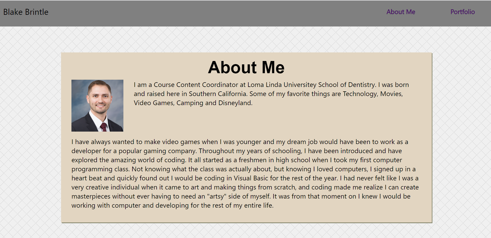
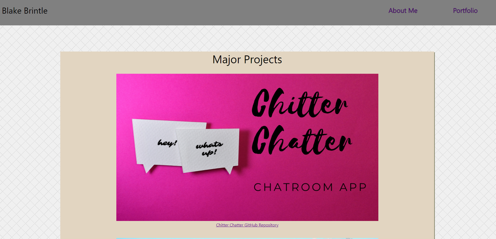

# React Portfolio

## Table of Contents
1. [ Description ](#desc)
2. [ Features ](#features)
3. [ Usage ](#usage)
4. [ Questions ](#quest)
    

## 1. Description
This application provided a react based solution to making my portfolio. I tried my best to make this portfolio look exactly like the pervious one, but added a little bit of flair where I felt it was needed.

## Features

* React
* Node.js

    

## 3. Usage
Simply select the link to flip back and forth between the aboutme page and the portfolio page.

 
<h3>React Portfolio</h3>

 

 

## 4. Questions
Please visit my GitHub to view all of my work:
https://www.github.com/bbrintle 

Check out the site:
https://blake-brintle-portfolio.herokuapp.com/

Contact me at: bbrintle@gmail.com